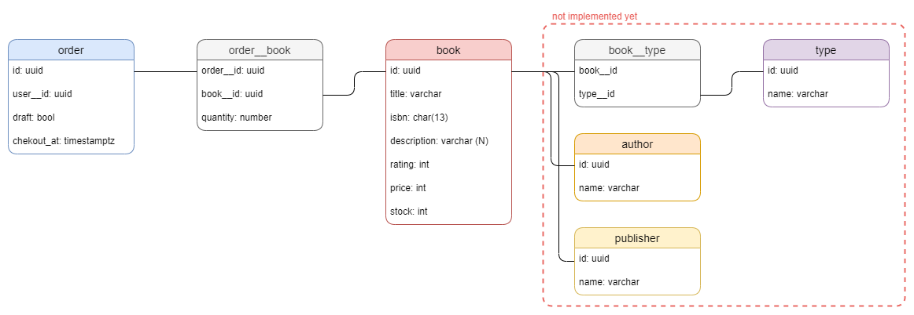

<h1 align="center">Welcome to Bookshop API 👋</h1>
<p>
  
  <a href="https://github.com/fabien-renaud/bookshop-api/blob/master/LICENSE" target="_blank">
    
  </a>
</p>

> REST API for a bookshop

### 🏠 [Homepage](https://github.com/fabien-renaud/bookshop-api#readme)

## Install

```sh
npm install
```

## Run dev

```sh
npm run dev
```

## Build and start

```sh
npm run start
```

## Run validation

```sh
npm run validate
```

## Database diagram


## Author

👤 **fabien-renaud**

* Github: [@fabien-renaud](https://github.com/fabien-renaud)
* Gitlab: [@fabien-renaud](https://gitlab.com/fabien-renaud)
* LinkedIn: [@fabien-renaud](https://linkedin.com/in/fabien-renaud)

## 🤝 Contributing

Contributions, issues and feature requests are welcome!<br />Feel free to check [issues page](https://github.com/fabien-renaud/bookshop-api/issues). 

## Show your support

Give a ⭐️ if this project helped you!

***
